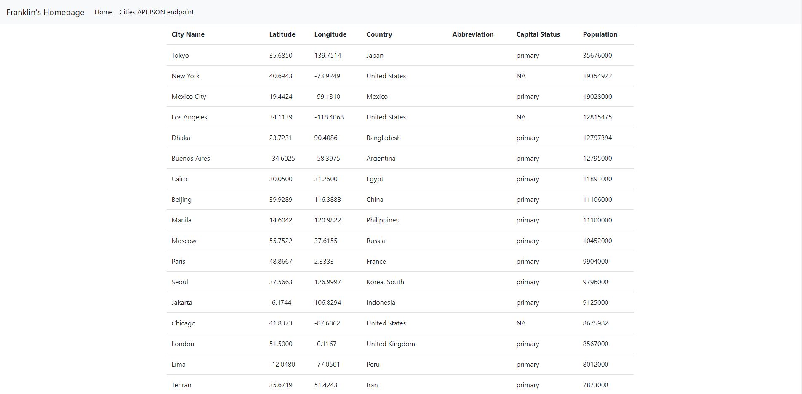

# PythonDockerFlaskPyCharmHW
## This project uses Python, Docker, MySQL, and PyCharm
## Franklin Tan
## March 29, 2021 -- Lesson 1
## April 5, 2021 -- Lesson 2
## April 12, 2021 -- Lesson 3
## April 12, 2021 -- Lesson 4

## SQL Data Screenshot

## Postman Screenshot

## Homepage Screenshot
