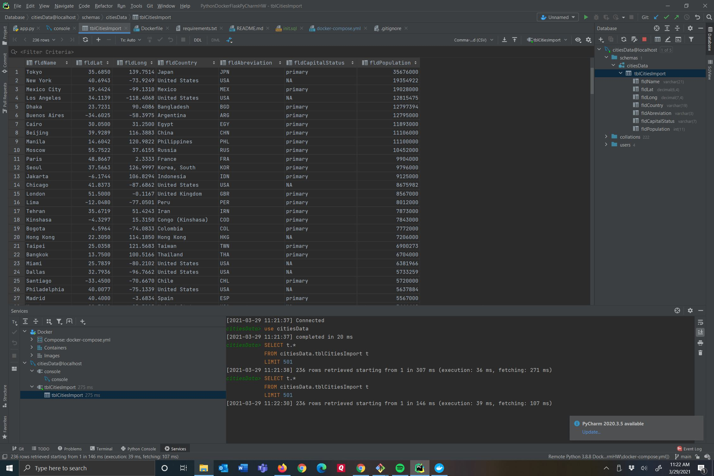
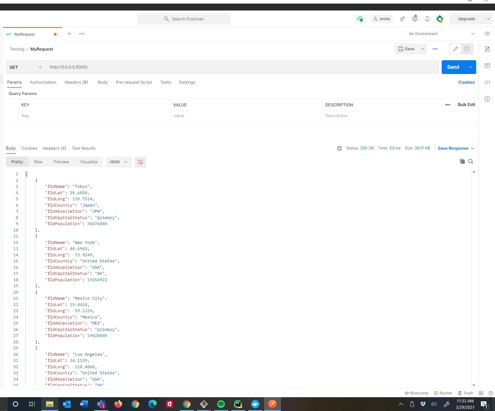

# PythonDockerFlaskPyCharmHW
## This project uses Python, Docker, MySQL, and PyCharm
## Franklin Tan
## March 29, 2021 -- Lesson 1
## April 5, 2021 -- Lesson 2

## SQL Data Screenshot

## Postman Screenshot
